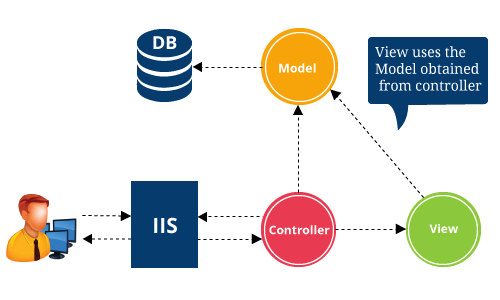

# Bookie Web
[Source](https://www.youtube.com/watch?v=AopeJjkcRvU&ab_channel=DotNetMastery)

--- ---

## Required Libraries


- Entity Framework Core
- Entity Framework Sql Server
- Entity Framework Tools

--- ---

## Add Database and Connection String

- Add connection string to **_appsettings.json_**
- Add **_DbContext_**

```C#
using Microsoft.EntityFrameworkCore;

namespace BookieWeb.Models
{
    public class ApplicationDbContext: DbContext
    {
        public ApplicationDbContext(DbContextOptions options): base(options) { 
        
        }
        // This is where we will be adding the 
    }
}

```

- Changes made in **_program.cs_**

```C#
using Microsoft.EntityFrameworkCore;

var builder = WebApplication.CreateBuilder(args);

// Add services to the container.
builder.Services.AddControllersWithViews();
// adding database connection
builder.Services.AddDbContext<BookieWeb.Models.ApplicationDbContext>(
    options => options.UseSqlServer(builder.Configuration.GetConnectionString("DefaultConnection"))
);
var app = builder.Build();

// Configure the HTTP request pipeline.
if (!app.Environment.IsDevelopment())
{
    app.UseExceptionHandler("/Home/Error");
    // The default HSTS value is 30 days. You may want to change this for production scenarios, see https://aka.ms/aspnetcore-hsts.
    app.UseHsts();
}

app.UseHttpsRedirection();
app.UseStaticFiles();

app.UseRouting();

app.UseAuthorization();

app.MapControllerRoute(
    name: "default",
    pattern: "{controller=Home}/{action=Index}/{id?}");

app.Run();

```

--- ---

## Database Migration

- Run following commands

```shell
Add-Migration "migration message"
Update-database
```

--- ---

## Routing in ASP.Net Core

- Routnig follows the following Rules

```C#
pattern: "{controller=Home}/{action=Index}/{id?}");
```

- controller/action/id



--- ---